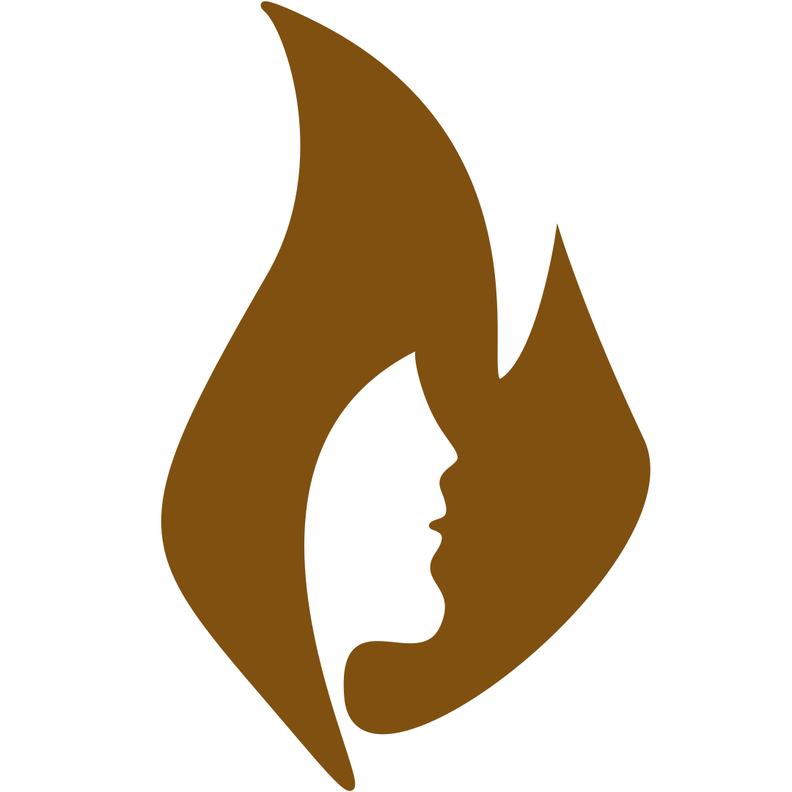

# 📸 Project Title: TopAIcal



### 👥 Team Members:
- Ronin Morata
- Samanta Chang
- Christopher Lee

## 📚 Project Description:

TopAIcal is an AI-powered web application built with Vue.js, designed to be a smart companion for skin health—especially for people of color. It leverages advanced machine learning to detect and interpret common skin concerns, offering personalized insights, support, and resources tailored to a wide range of skin tones. With inclusivity at its core, TopAIcal aims to bridge the gap in dermatological care by making skin health more accessible, accurate, and representative for everyone.

### 🔍 Features:
- 📷 Camera integration to capture images directly from the browser.
- 🖼️ File upload with image preview.
- 🧠 An AI-powered image classification model that analyzes and displays results.

### 🛠️ Technologies Used:
- Vue 3
- JavaScript
- HTML/CSS

## 🚀 How to Set Up Locally:

1. **Clone the Repository**:
    ```bash
    git clone https://github.com/rpmorata/SFhacks2025-AI-Project.git
    cd SFhacks2025-AI-Project
    ```

2. **Install Dependencies**:
    Make sure you have Node.js installed. Then run:
    ```bash
    npm install
    ```

3. **Run the Development Server**:
    Start the application locally:
    ```bash
    npm run dev
    ```